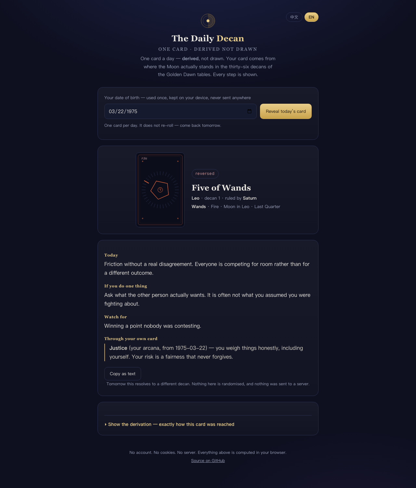

# The Daily Decan

**One card a day — derived, not drawn.**

Most "daily card" apps roll a random number and dress it up. This one doesn't. Your card for
today is the card of the **decan the Moon is actually standing in** — and every step of that
calculation is printed on the page, in plain sight.

Live: `https://<your-user>.github.io/daily-decan/` · Single file · No build step · MIT



---

## Why it is not a random generator

There is a real system underneath, and it is fully auditable.

| Step | What happens | Where it comes from |
|---|---|---|
| 1 | Today's date → Julian day | standard astronomy |
| 2 | The Moon's ecliptic longitude for that moment | Meeus, truncated series (±1.5°) |
| 3 | That longitude, divided into 10° bands → **decan 1–36** | the 36 decans of the zodiac |
| 4 | The decan → its **minor arcana card and ruling planet** | Golden Dawn *Book T* attributions |
| 5 | The Sun's longitude → elongation → **moon phase** | standard astronomy |
| 6 | Waxing → **upright**, waning → **reversed** | standard practice |
| 7 | Your birth date → digits reduced to 1–22 → **your arcana** | standard numerology reduction |

Because the Moon moves about 13.2° a day, it crosses a decan roughly **every 18 hours** — so the
card genuinely changes day to day, without anyone faking it.

You can check step 2 against any ephemeris. If it disagrees, that is a bug, and I want the issue.

---

## What makes it different

**It shows its work.** Every reading is followed by a collapsible derivation panel listing the
Julian day, the Moon's longitude to two decimals, the Sun's longitude, the elongation, the decan
index, and your own reduction. Nothing is hidden behind "the cards have spoken".

**The art is generated, not drawn.** There are no scanned decks and no copyright problems. Each
card's sigil is computed from its own correspondences: the suit sets the colour, the card's
number sets the polygon, the decan lights one of thirty-six ticks around the ring, and the ruling
planet sets the glyph. No two cards produce the same mark, and no two sites using this code will
ship the same images.

**The readings refuse to flatter.** There is no "you are a caring person who sometimes doubts
themselves". Each card gives one plain observation, one concrete action, and one thing to watch
for. If a line could apply to anybody, it does not belong here.

**Nothing leaves your device.** No account, no cookies, no analytics, no server, no network call.
The whole thing is one HTML file. You can run it from `file://` with the wifi off.

---

## The constraints (deliberate, not oversights)

- **One card per day.** There is no re-roll button. A daily practice is not a slot machine.
- **The system is stated as a system.** The page says plainly that this is built on published
  correspondences. It does not claim to predict anything, and it does not pretend to be ancient
  wisdom handed down intact.
- **No dark patterns.** No streak guilt, no notifications, no upsell, no "unlock the full
  reading". One page, one answer, done.

Honesty about what this is happens to make it *more* compelling, not less. A fortune teller who
shows you the mechanism is more interesting than one who does not.

---

## Run it

Download `index.html` and open it. That is the entire installation.

```bash
git clone https://github.com/<your-user>/daily-decan
open daily-decan/index.html
```

### Publish it (GitHub Pages, free, 60 seconds)

1. Push this repo.
2. **Settings → Pages → Source: Deploy from a branch → `main` / `root`**.
3. Your URL is `https://<your-user>.github.io/daily-decan/`.

Works offline once loaded. Add it to a home screen and it behaves like an app.

---

## Using it as a library

Everything is in one `<script>`, in plain ES2020 with no dependencies. The parts are separable:

- `julianDay(y,m,d)`, `sunLon(jd)`, `moonLon(jd)` — the astronomy
- `phaseName(elong)`, `isWaxing(elong)` — the phase
- `DECANS` — the 36 decan attributions as data
- `sigil(card, decanIndex, planet, reversed)` — returns SVG, given any card
- `birthArcana(iso)` — the reduction

Fork it and swap in the Thoth deck's attributions, the 36 *strategemata*, or the Chinese
twenty-eight mansions. The skeleton does not care what the table contains.

---

## Honest limits

- The lunar longitude is a truncated series, good to about ±1.5°. Near a decan boundary the card
  may be off by a day. Use a full ephemeris if that matters to you.
- The birth-arcana reduction is a convention, not a law. Different schools map 22 differently; I
  use the common one where 22 becomes The Fool.
- The `Book T` attributions are quoted as published; traditions differ on the ordering of a few
  decans, and I have not adjudicated that.
- This is a piece of design, not a metaphysical claim. Enjoy it as such.

---

## Licence

MIT — see `LICENSE`. Use it, fork it, ship it, sell it.

The decan attributions and trump correspondences are historical material and are not claimed as
original work. The text of the 58 readings, the generative sigils, and the implementation are.

---

*If you build something with this, I would like to see it. Open an issue.*
